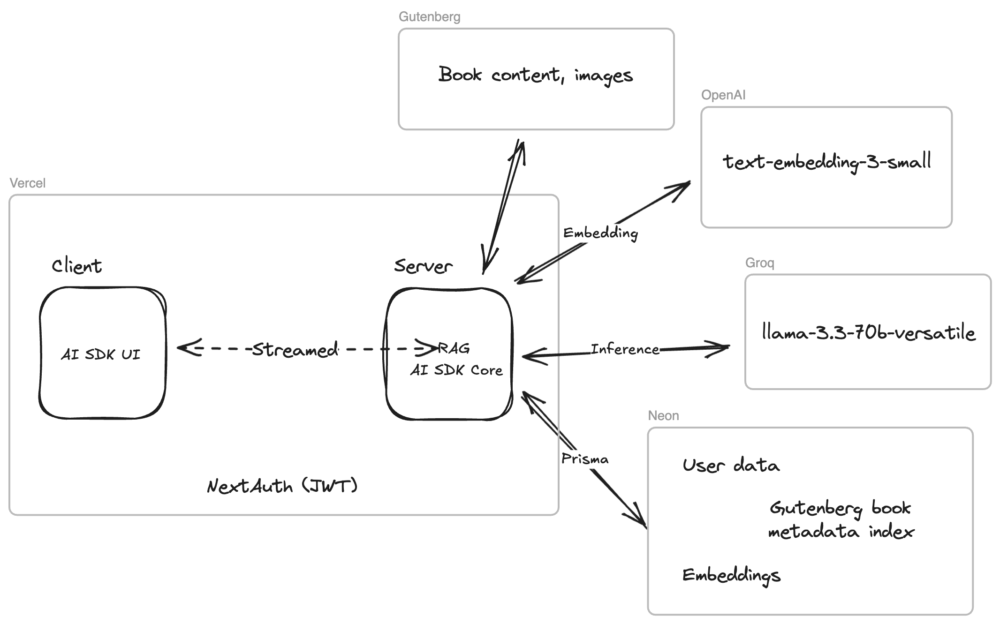

# Gutenberg


See [demo and design writeup here](https://anmiller.com/essays/gutenberg-llm).

## Development

```sh
# Clone
git clone https://github.com/anmilleriii/gutenberg-llm.git

# Install
pnpm i

# Get env
vercel auth login
vercel link
vercel env pull

# Run
pnpm dev
```

## Deployment

GHA runs Vitest on all PR's. Vercel deploys on push/pull to `main`.
